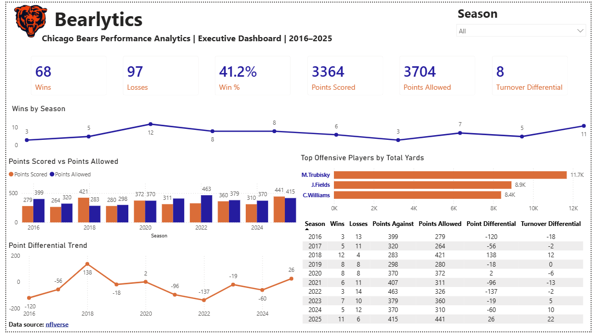
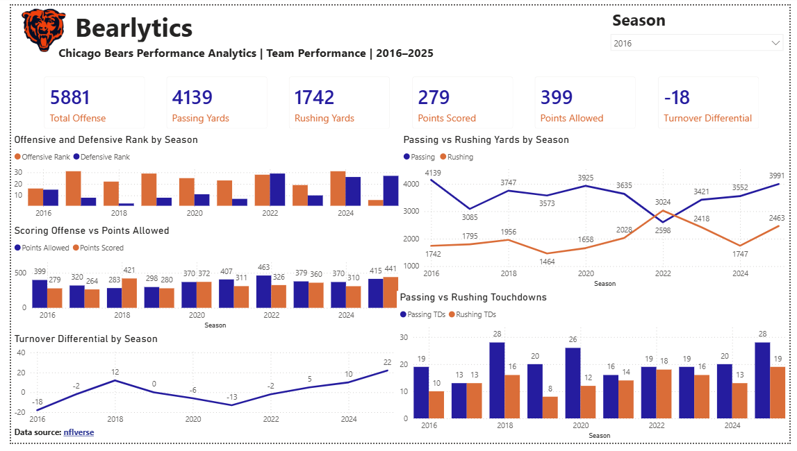
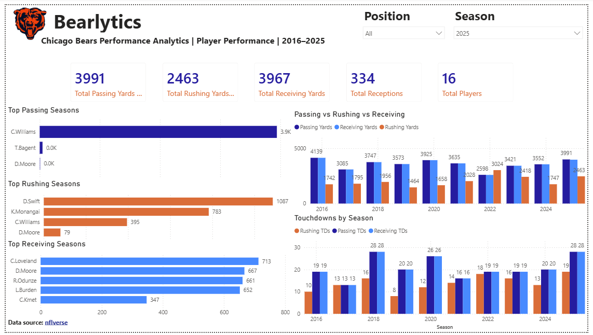
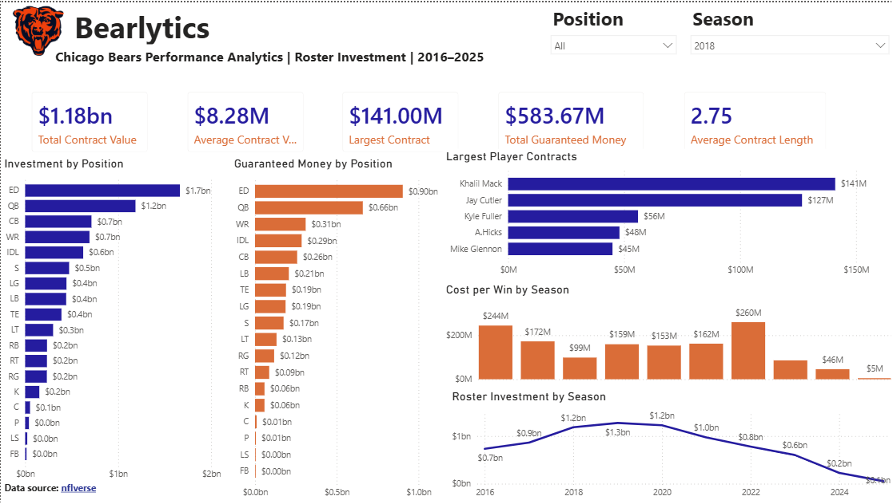
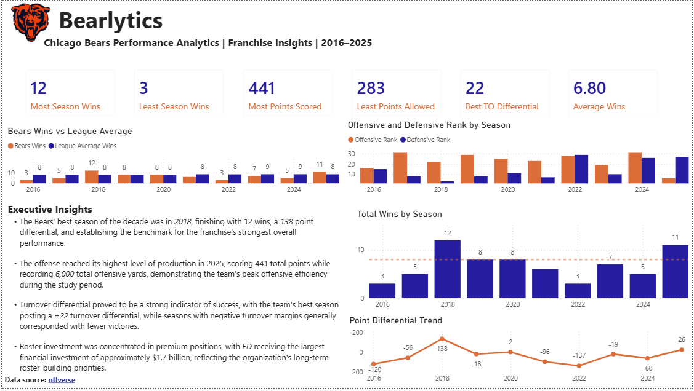

# Phase 4 — Power BI Development & DAX Modeling

Transforms the validated SQL analytical model from Phase 3 into a fully interactive business intelligence application using Microsoft Power BI. Five executive-focused dashboard pages answer distinct business questions about Chicago Bears franchise performance from 2016–2025.

---

## Dashboard Pages

### 01 — Executive Summary
*"How has the franchise performed over the last decade?"*

KPI cards for total wins (68), losses (97), win percentage (41.2%), points scored, points allowed, and turnover differential. Line chart of wins by season, clustered bar chart of points scored vs. allowed, point differential trend line, top offensive players by total yards, and a season-by-season summary table.

---

### 02 — Team Performance
*"Which areas of team performance improved or declined?"*

Offensive and defensive rank by season, passing vs. rushing yards trend, scoring offense vs. points allowed, passing vs. rushing touchdowns by season, and turnover differential over time. Season slicer filters all visuals to a single year.

---

### 03 — Player Performance
*"Which players drove offensive success?"*

KPI cards for total passing yards, rushing yards, receiving yards, receptions, and total players. Top passing, rushing, and receiving leaders by season. Grouped bar chart comparing passing vs. rushing vs. receiving production by year, and touchdown breakdown by type per season. Position and season slicers.

---

### 04 — Roster Investment
*"How effectively was roster spending converted into team performance?"*

KPI cards for total contract value ($1.18bn), average contract value, largest contract, guaranteed money, and average contract length. Investment and guaranteed money breakdowns by position, largest player contracts, cost per win by season, and roster investment trend over time.

---

### 05 — Franchise Insights
*"What are the key long-term insights from the Bears' performance?"*

Summary KPIs (most wins in a season, least wins, most points scored, least points allowed, best turnover differential, average wins), Bears wins vs. league average, offensive and defensive rank by season, total wins bar chart with average reference line, point differential trend, and written executive observations.

---

## Data Model

Star schema with one-to-many relationships from dimension tables to fact tables.

| Table | Description |
|---|---|
| `fact_team_stats` | Season-level Bears team statistics |
| `fact_game_logs` | Individual game records |
| `fact_player_stats` | Season-level player production |
| `fact_salary_data` | Player contract and salary data |
| `fact_nfl_league_stats` | League-wide stats for benchmarking |
| `dim_teams` | 32 NFL franchises, conference/division |
| `dim_players` | 510 players, name/position/seasons |
| `dim_positions` | 18 positions across offense/defense/ST |
| `date_dimension` | 3,653 days with year/season/week attributes |

---

## DAX Measures (30+)

**Executive Performance** — Total Wins, Total Losses, Win Percentage, Best Season, Worst Season, Average Wins

**Offensive Production** — Points Scored, Points Allowed, Point Differential, Passing Yards, Rushing Yards, Total Offensive Yards, Turnover Differential

**Player Performance** — Passing Leaders, Rushing Leaders, Receiving Leaders, Total Offensive Production

**Roster Investment** — Total Contract Value, Average Contract Value, Largest Contract, Guaranteed Money, Cost Per Win, Average Contract Length

**League Comparison** — League Average Wins, Offensive Rank, Defensive Rank, Bears vs. League Difference

All measures are reusable and update dynamically in response to every filter, slicer, and cross-filter interaction.

---

## Interactive Features

| Feature | Description |
|---|---|
| Season Slicers | Filter all visuals by individual season or multi-season range |
| Position Filters | Isolate offensive, defensive, or special teams players |
| Cross-Filtering | Selecting any visual filters all related visuals on the page |
| Dynamic KPI Cards | Key metrics update in real time with every filter change |
| Drill-Through | Navigate from summary pages to detailed player or game records |
| Interactive Tooltips | Hover over any data point for contextual detail |
| Dynamic Titles | Chart headings update automatically to reflect active filters |
| Responsive Filtering | Filter state persists consistently across all five report pages |

---

## Design

Consistent design language applied across all five pages aligned with Chicago Bears branding — navy, orange, and white color palette; standardized KPI card format; uniform spacing and alignment; minimalist layout with deliberate use of white space.

---

## File

| File | Description |
|---|---|
| `bearlytics.pbix` | Complete Power BI report with all five pages, DAX measures, and data model |

---

*Data source: nflverse · Seasons covered: 2016–2025*
